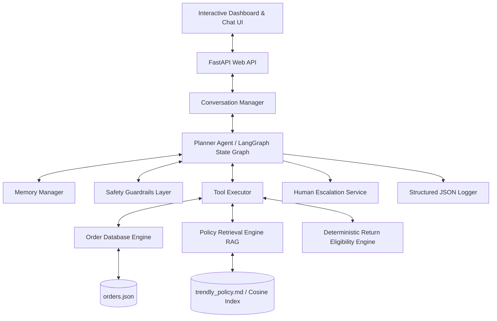

# System Architecture (ARCHITECTURE.md)

This document describes the high-level architecture, data flow pipelines, and isolation layers of the Trendly Support Assistant.

---

## 1. High-Level Architecture Diagram



---

## 2. Key Architecture Layers

### A. Conversation State & Memory Manager (`state.py`)
Maintains structured memory variables (`customer_id`, `is_authenticated`, `current_order_id`, `current_return`, `escalated`, `tool_traces`) alongside raw chat logs. 
*   **Why it exists**: Keeping memory in a structured object ensures the agent's context is immune to prompt injection-based memory erasure.

### B. Safety & Guardrails Layer (`safety.py`)
Performs pre-processing (input sanitization) and post-processing (output verification) audits.
*   **Pre-Processing**: Rejects prompt injection payloads, card numbers, or bank account details.
*   **Post-Processing**: Rejects responses containing unauthorized discount offerings or manual PII collection.
*   **Access Isolation**: Checks order customer ID against session authenticated customer ID to prevent cross-customer data leakage.

### C. Deterministic Engines (`database.py` & `rules.py`)
Contains the database wrapper (`OrderDatabase`) and the rule evaluator (`PolicyRulesEngine`).
*   **Order Engine**: Exposes clean methods to fetch records from `orders.json` but never exposes raw JSON.
*   **Return Eligibility Engine**: 100% deterministic Python logic evaluating policy windows and category restrictions.
    *   *Rule*: Date difference calculations use `datetime` object subtraction.
    *   *Rule*: Category checks use set exclusion (`NON_RETURNABLE_CATEGORIES`).
    *   *Rule*: Returns against cancelled orders are rejected automatically.

### D. Policy Retrieval (RAG) Engine (`rag.py`)
Chunks `trendly_policy.md` by sections, computes embeddings, and calculates cosine similarity.
*   **Query Expansion**: Detects synonyms (e.g. "earrings" -> "jewellery", "socks" -> "innerwear") in query text, boosting the retrieval confidence of the exact matching policy sections.
*   **Confidence Guard**: Retrieves chunks with similarity weights. If the highest score is below a strict threshold (0.25 on local tf-idf or 0.65 on embedding space), the query is treated as "outside of policy," trigger human escalation.

---

## 3. Core Data Flow Pipelines

### 1. Order Details Request Pipeline
```
Customer Query -> Input Safety Scan -> Authenticated Check -> Order Ownership Check -> Get Order Details Tool -> Format Output -> Output Safety Scan -> User
```

### 2. Return Eligibility Evaluation Pipeline
```
Customer Query -> Input Safety Scan -> Authenticated Check -> Fetch Order -> Verify SKU belongs to Order -> Calculate Date Window -> Check Category Restrictions -> Calculate Box Deductions -> Set Session Return State -> Generate Explanation -> Output Safety Scan -> User
```

### 3. Human Escalation Pipeline
```
Safety Breach OR Lost Parcel OR COD Request -> Mark Session Escalated -> Generate Hand-off card -> Lock Session Inputs -> Handoff to human queue -> Notify User
```
